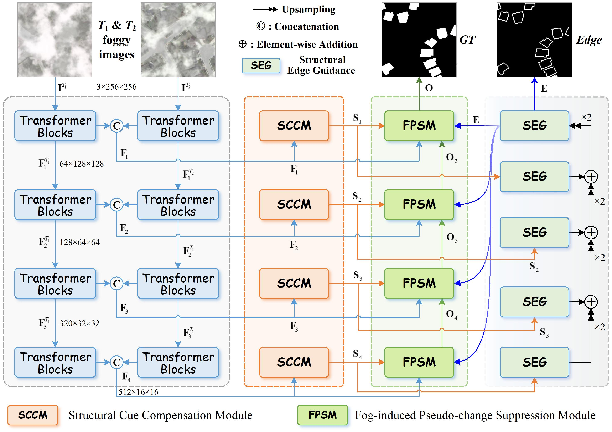

# SRCL-Net: Structure-Compensated Reliable Change Learning for Foggy Remote Sensing Change Detection


<p align="center">
  
  
  
  
</p>


## :pushpin: Introduction

This repository provides the implementation of a **Structure-Compensated Reliable Change Learning Network (SRCL-Net)** for **foggy remote sensing change detection**.

Fog interference usually weakens structural cues of real changed regions and induces pseudo-change responses in unchanged backgrounds. To address this issue, CDRNet restores change discriminability by compensating fog-weakened structural cues and disentangling fog-induced pseudo-change responses during progressive change decoding.


<p align="center">
  
</p>

SRCL-Net consists of the following components:

- **Structural Cue Compensation Module (SCCM)**  
  Compensates fog-weakened structural cues through spatial semantic preservation and wavelet-domain structural modeling.

- **Structural Edge Guidance (SEG)**  
  Aggregates multi-scale structure-enhanced features to generate edge guidance for boundary-aware decoding.

- **Fog-induced Pseudo-change Suppression Module (FPSM)**  
  Suppresses fog-induced pseudo-change responses and progressively decodes reliable changed regions.

---

## :rocket: Installation

```text
SRCL-Net/
├── network/
│   ├── SRCL-Net.py
│   ├── SCC.py
│   ├── FPS.py
│   ├── Edge.py
│   ├── cd_tools.py
│   └── backbones/
│       └── pvtv2.py
├── utils/
│   ├── dataloader.py
│   ├── metrics.py
│   └── tools.py
├── pretrained_model/
│   └── pvt_v2_b2.pth
├── figures/
│   └── SRCL-Net_framework.jpg
├── train.py
├── requirements.txt
└── README.md
```


```bash
git clone https://github.com/your-username/SRCL-Net.git
cd SRCL-Net

conda create -n ournet python=3.8
conda activate ournet

pip install -r requirements.txt
```

Please install a PyTorch version compatible with your CUDA version.
A typical environment includes:

```text
python >= 3.10
torch >= 2.10
torchvision
numpy
opencv-python
tqdm
scikit-learn
Pillow
```


SRCL-Net adopts **PVT-v2-B2** as the weight-sharing backbone. 
Please download the pretrained PVT-v2-B2 model and place it under:

```text
./pretrained_model/pvt_v2_b2.pth
```

The default path is:

```python
path = './pretrained_model/pvt_v2_b2.pth'
```


## :open_file_folder: Dataset Preparation

The new foggy RSCD datasets can be obtained from the [Cloud Drive](https://pan.jiangnan.edu.cn/link/AA0298DDB05F1E43F6A70CF8A4D664AAA3) [PW: RSCD].

Please organize the dataset as follows:

```text
Foggy RSCD Dataset/
├── train/
│   ├── A/
│   ├── B/
│   └── label/
└── test/
    ├── A/
    ├── B/
    └── label/
```

Each sample contains:

- `A`: image at the first time point
- `B`: image at the second time point
- `label`: binary change mask

The ground-truth mask should follow:

```text
0: unchanged
1: changed
```

---

## :hourglass_flowing_sand: Training

Modify the dataset path and training configuration in `train_v2.py`, then run:

```bash
python train.py \
  --data_name foggy-LEVIR-CD \
  --epoch 200 \
  --batchsize 32 \
  --trainsize 256 \
  --lr 1e-4 \
  --edge_weight 0.1 \
  --reg_weight 1e-4
```

Main options:

```text
--data_name       dataset name
--epoch           number of training epochs
--batchsize       batch size
--trainsize       input image size
--lr              learning rate
--edge_weight     weight of edge supervision
--reg_weight      weight of regularization
```

The trained model will be saved to:

```text
./train_output/SRCL-Net/{data_name}/
```


## :bar_chart: Testing

After training, run:

```bash
python test.py \
  --data_name foggy-LEVIR-CD \
  --model_path ./train_output/SRCL-Net/foggy-LEVIR-CD/Seg_epoch_best.pth
```

The predicted change maps will be saved in the configured output directory.

---

## :bookmark_tabs: Citation

If you find this repository useful, please consider citing our paper:

```bibtex
@article{srcl2026zhou,
  title={Structure-Compensated Reliable Change Learning for Foggy Remote Sensing Change Detection},
  author={},
  journal={},
  year={2026}
}
```


## Acknowledgement
### :clap::clap::clap: Thanks to the authors of remote sensing change detection for their excellent works！


